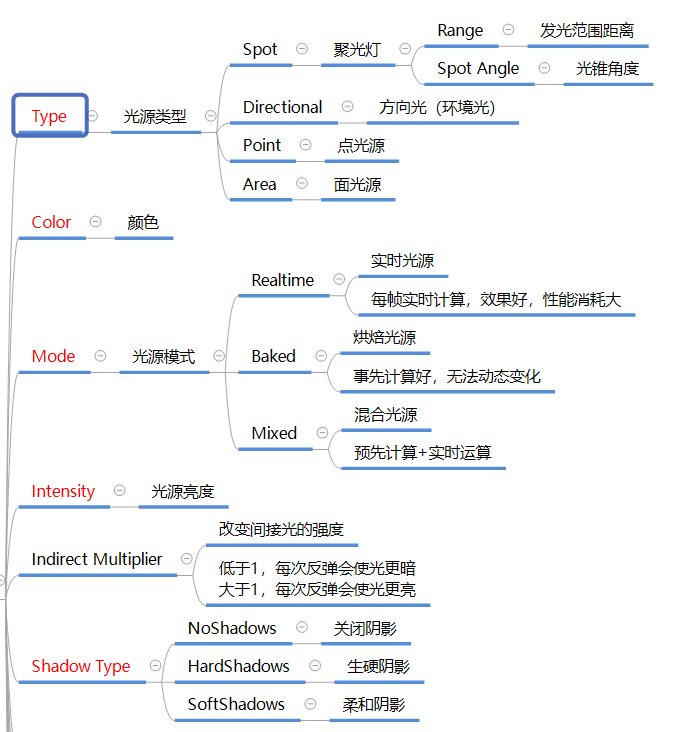
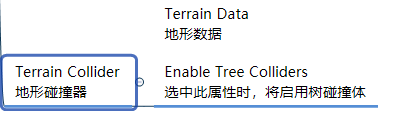

# 目录
- [0.00 Unity入门+实践 重点合并](#000-unity%E5%85%A5%E9%97%A8%E5%AE%9E%E8%B7%B5-%E9%87%8D%E7%82%B9%E5%90%88%E5%B9%B6)
		- [2. 单例模式的使用](#2-%E5%8D%95%E4%BE%8B%E6%A8%A1%E5%BC%8F%E7%9A%84%E4%BD%BF%E7%94%A8)
		- [3. 物体移动和力的应用](#3-%E7%89%A9%E4%BD%93%E7%A7%BB%E5%8A%A8%E5%92%8C%E5%8A%9B%E7%9A%84%E5%BA%94%E7%94%A8)
		- [4.**项目实践中的一些总结:**](#4%E9%A1%B9%E7%9B%AE%E5%AE%9E%E8%B7%B5%E4%B8%AD%E7%9A%84%E4%B8%80%E4%BA%9B%E6%80%BB%E7%BB%93)
		- [关键改进点：](#%E5%85%B3%E9%94%AE%E6%94%B9%E8%BF%9B%E7%82%B9)
		- [总结：](#%E6%80%BB%E7%BB%93)
- [0.01快捷键](#001%E5%BF%AB%E6%8D%B7%E9%94%AE)
	- [补充内容：](#%E8%A1%A5%E5%85%85%E5%86%85%E5%AE%B9)
- [0.03反射](#003%E5%8F%8D%E5%B0%84)
- [0.04 Inspector窗口](#004-inspector%E7%AA%97%E5%8F%A3)
	- [](#)
	- [补充内容：编辑器按钮特性](#%E8%A1%A5%E5%85%85%E5%86%85%E5%AE%B9%E7%BC%96%E8%BE%91%E5%99%A8%E6%8C%89%E9%92%AE%E7%89%B9%E6%80%A7)
- [0.05Unity的工作机制](#005unity%E7%9A%84%E5%B7%A5%E4%BD%9C%E6%9C%BA%E5%88%B6)
	- [说明：](#%E8%AF%B4%E6%98%8E)
- [0.06脚本相关 生命周期函数](#006%E8%84%9A%E6%9C%AC%E7%9B%B8%E5%85%B3-%E7%94%9F%E5%91%BD%E5%91%A8%E6%9C%9F%E5%87%BD%E6%95%B0)
	- [1. **"Don't Call Methods in Awake" (Monobehaviours and ScriptableObject)**](#1-dont-call-methods-in-awake-monobehaviours-and-scriptableobject)
	- [2. **"All State Should Be Safe to Access by Start"**](#2-all-state-should-be-safe-to-access-by-start)
	- [3. **"Check All Uses of Variables Initialized in Start"**](#3-check-all-uses-of-variables-initialized-in-start)
	- [总结：](#%E6%80%BB%E7%BB%93)
- [0.07Transform的学习](#007transform%E7%9A%84%E5%AD%A6%E4%B9%A0)
	- [总结](#%E6%80%BB%E7%BB%93)
	- [1. `Transform.TransformPoint`](#1-transformtransformpoint)
	- [2. `Transform.TransformDirection`](#2-transformtransformdirection)
	- [3. `Transform.TransformVector`](#3-transformtransformvector)
- [0.08基础知识总结](#008%E5%9F%BA%E7%A1%80%E7%9F%A5%E8%AF%86%E6%80%BB%E7%BB%93)
- [0.49摄像机相关知识](#049%E6%91%84%E5%83%8F%E6%9C%BA%E7%9B%B8%E5%85%B3%E7%9F%A5%E8%AF%86)
- [0.53光源](#053%E5%85%89%E6%BA%90)
- [0.56刚体参数说明图](#056%E5%88%9A%E4%BD%93%E5%8F%82%E6%95%B0%E8%AF%B4%E6%98%8E%E5%9B%BE)
- [刚体参数说明图](#%E5%88%9A%E4%BD%93%E5%8F%82%E6%95%B0%E8%AF%B4%E6%98%8E%E5%9B%BE)
	- [Interpolate 属性](#interpolate-%E5%B1%9E%E6%80%A7)
	- [Constraints](#constraints)
	- [Collision Detection](#collision-detection)
- [0.57碰撞器参数说明](#057%E7%A2%B0%E6%92%9E%E5%99%A8%E5%8F%82%E6%95%B0%E8%AF%B4%E6%98%8E)
	- [Root主物体有Rigidbody,然后子物体,里面存储各种碰撞信息,这样就可以检测其他的碰撞](#root%E4%B8%BB%E7%89%A9%E4%BD%93%E6%9C%89rigidbody%E7%84%B6%E5%90%8E%E5%AD%90%E7%89%A9%E4%BD%93%E9%87%8C%E9%9D%A2%E5%AD%98%E5%82%A8%E5%90%84%E7%A7%8D%E7%A2%B0%E6%92%9E%E4%BF%A1%E6%81%AF%E8%BF%99%E6%A0%B7%E5%B0%B1%E5%8F%AF%E4%BB%A5%E6%A3%80%E6%B5%8B%E5%85%B6%E4%BB%96%E7%9A%84%E7%A2%B0%E6%92%9E)
- [0.58碰撞器物体材质](#058%E7%A2%B0%E6%92%9E%E5%99%A8%E7%89%A9%E4%BD%93%E6%9D%90%E8%B4%A8)
	- [静态摩擦力](#%E9%9D%99%E6%80%81%E6%91%A9%E6%93%A6%E5%8A%9B)
		- [例子](#%E4%BE%8B%E5%AD%90)
	- [动态摩擦力](#%E5%8A%A8%E6%80%81%E6%91%A9%E6%93%A6%E5%8A%9B)
		- [例子](#%E4%BE%8B%E5%AD%90)
- [0.59-0.62碰撞生命周期,碰撞检测,刚体](#059-062%E7%A2%B0%E6%92%9E%E7%94%9F%E5%91%BD%E5%91%A8%E6%9C%9F%E7%A2%B0%E6%92%9E%E6%A3%80%E6%B5%8B%E5%88%9A%E4%BD%93)
	- [动量定理基础](#%E5%8A%A8%E9%87%8F%E5%AE%9A%E7%90%86%E5%9F%BA%E7%A1%80)
	- [力的应用方式](#%E5%8A%9B%E7%9A%84%E5%BA%94%E7%94%A8%E6%96%B9%E5%BC%8F)
	- [力的模式 (ForceMode)](#%E5%8A%9B%E7%9A%84%E6%A8%A1%E5%BC%8F-forcemode)
	- [动态计算示例](#%E5%8A%A8%E6%80%81%E8%AE%A1%E7%AE%97%E7%A4%BA%E4%BE%8B)
- [0.63音频导入](#063%E9%9F%B3%E9%A2%91%E5%AF%BC%E5%85%A5)
- [Unity入门](#unity%E5%85%A5%E9%97%A8)


## 0.00 Unity入门+实践 重点合并

我主要在这里留下了一些我自己学习上不懂的,来加强学习


重点错误:一个物体子物体有Rb和collider,它本身是一个空的gameobject,如果在它身上挂载脚本去检测是否和别的物体碰撞是不会触发的,这是为什么?
1. **碰撞检测的前提条件:**
    
    - 参与碰撞的两个物体必须都有Collider组件,且至少有一个物体还需要Rigidbody组件。
    - 如果父对象没有Collider和Rigidbody,即使子对象有,父对象上的脚本也无法检测到碰撞。
2. **空GameObject的作用和限制:**
    
    - 通常用于组织场景结构或作为子对象的容器。
    - 如果没有Collider或Rigidbody,它不会参与物理碰撞,无法触发碰撞事件。
3. **Transform的几个常用方法:**
    
    - TransformPoint考虑位置、旋转和缩放。
    - TransformDirection只考虑旋转。
    - TransformVector考虑旋转和缩放,不考虑位置。(**向量**：在游戏开发中，向量常用来表示方向和距离，但不具有具体位置。)

```cs
Transform child = transform.Find("Parent/Child");
//`Transform.Find` 方法可以通过路径查找子对象或子对象的子对象。路径中的斜杠 `/` 用于区分父子关系。
```
**四元数 vs 欧拉角**：`transform.rotation` 使用四元数表示旋转，虽然计算精确，但不直观。`transform.eulerAngles` 使用更易理解的三维向量表示旋转角度，适合直接操作。
#### 2. 单例模式的使用

**单例模式的正确用法**：

- 单例模式通常在 `Awake` 方法中初始化 `Instance`，确保在使用类名加 `Instance` 访问时，单例已经正确初始化。

**常见问题**：

- 如果在 `Awake` 中未初始化 `Instance`，将导致在其他地方使用 `类名.Instance` 时出现 `null` 引用，无法正确访问单例对象。

**泛型约束**：

- 如果使用泛型单例模式，需要对泛型参数进行约束，例如限定为某个基类或接口。确保泛型类型在单例中能够被正确使用。

```cs
public class Singleton<T> : MonoBehaviour where T : class
{
    public static T Instance { get; private set; }

    protected virtual void Awake()
    {
        Instance = this as T;
    }
}

```


你要有Collider或者是trigger,可以没有**rigidbody**,挂载脚本,就能响应OnCollider/OnTrigger
重点:如果是Rigidbody里面的子物体有脚本来检测是否碰撞,是不会**触发**的

#### 3. 物体移动和力的应用

**重要概念**：

- **AddForce**：通过 `AddForce` 给物体施加力，使其沿指定方向移动。适用于模拟物理效果的场景。
- **改变 Position/Translate**：直接设置物体的位置，用于不需要物理模拟的情况。
- **爆炸力 (`AddExplosionForce`)**：针对单个 `Rigidbody` 使用，施加爆炸效果，力的作用受物体质量、阻尼等物理属性影响。


- **不要在`Awake`中调用依赖于其他对象或组件状态的方法**，以确保初始化顺序的正确性。
- **所有状态在`Start`时都应该是安全和稳定的**，以便你可以在`Start`中安全地进行依赖于其他组件的初始化。
- **检查所有在`Start`中初始化的变量**，确保它们不会在不合适的时机被访问。

#### 4.**项目实践中的一些总结:**
    
    - 尽量精简UI标签,可以把多个同类型的数据放在一个标签下处理。
    - 注意在Awake中绑定必要的组件引用,否则可能出现空引用错误。
    - 理解GameDataManager的使用,注意它没有继承MonoBehaviour。
    - List可以直接移除指定索引之后的所有元素,不需要遍历。
    - 单例模式下切换场景时instance的重新指向。
    - 跟随目标移动可以直接用偏移量,而不是用坐标相减的方式。
-  **武器实例化的代码改进:**
    
    - 确保currentWeapon引用的是Instantiate生成的对象,而不是预制体。
    - 保证生成的武器位置和旋转与挂载点weaponPoint对齐。
    - 对currentWeapon的操作将作用于正确的实例化武器对象。
-  **场景切换与单例模式的问题**
    
    - 在切换场景时，如果 `SettingPanel` 使用单例模式，新的场景中会生成一个新的 `SettingPanel` 实例。在这个过程中，新的 `SettingPanel` 会在其 `Awake()` 方法中将单例 `Instance` 重新指向自己，导致先前场景中的 `Instance` 被覆盖。
    - 每次场景切换，新的 `SettingPanel` 会覆盖原有的单例实例，这可能会导致引用不一致，尤其是在 `GameDataManager` 或其他管理器中需要访问该 `SettingPanel` 时。
    - 可以在 `Awake()` 中使用 `DontDestroyOnLoad`，并确保在新场景中不会再次生成 `SettingPanel` 的实例。
    - 
```cs
public class SettingPanel : MonoBehaviour
{
    public static SettingPanel Instance { get; private set; }

    protected virtual void Awake()
    {
        if (Instance == null)
        {
            Instance = this;
            DontDestroyOnLoad(gameObject); // 保留实例跨场景
        }
        else
        {
            Destroy(gameObject); // 如果已经有一个实例存在，销毁新的实例
        }
    }
}

```


``` csharp
public void SetWeapon(Weapon weapon)
{
    this.currentWeapon = weapon; //实际上这里是错误的使用,currentWeapon和下面的代码一点关系都没用
    Instantiate(weapon.gameObject, weaponPoint.position, weaponPoint.rotation, weaponPoint);
}

```
#### 关键改进点：

1. **正确引用实例化对象**：修改后的代码确保 `currentWeapon` 引用的是通过 `Instantiate` 生成的武器对象，而不是传入的预制体。
    
2. **保证位置和旋转正确**：通过实例化后再赋值给 `currentWeapon`，确保了该对象的位置和旋转与 `weaponPoint` 对齐。
    
3. **后续使用正确对象**：现在，任何对 `currentWeapon` 的操作（例如在 `Fire` 方法中）都会作用于正确的实例化武器对象，从而保证其行为符合预期。
    

#### 总结：

原代码的问题在于 `currentWeapon` 引用了预制体，而非实例化后的武器对象，导致位置和行为异常。通过将 `currentWeapon` 赋值为实例化后的武器对象，问题得以解决，确保了武器的位置和行为正确无误。

## 0.01快捷键

| **操作类别** | **操作方法**                  | **功能**               |
| -------- | ------------------------- | -------------------- |
| **左键相关** | 鼠标单击                      | 选择单个物体               |
|          | 鼠标框选                      | 选择多个物体               |
|          | `按住Ctrl + 鼠标单击`           | 多选物体                 |
|          | 鼠标右键按下 + 移动鼠标             | 旋转视口                 |
|          | 长按`ALT`键 + 鼠标左键 + 移动鼠标    | 相对观察视口中心点旋转          |
|          | 选中物体之后，按`F`键              | 居中显示物体（或者在层级窗口中双击对象） |
| **右键相关** | 鼠标右键按下 + 移动鼠标             | 旋转视口                 |
|          | 鼠标右键按下 + `WASD`           | 漫游场景                 |
|          | 鼠标右键按下 + `WASD` + `Shift` | 快速漫游场景               |
|          | 长按`ALT`键 + 鼠标右键 + 移动鼠标    | 相对屏幕中心点拉近拉远          |
| **中键相关** | 滚动鼠标中间                    | 相对屏幕中心点拉近拉远          |
|          | 鼠标中间按下 + 移动鼠标             | 平移观察视口               |
|          | 长按`ALT`键 + 滚动鼠标中间         | 鼠标指哪就朝哪拉近拉远          |

### 补充内容：

1. **WASD 漫游**: 该操作方式类似于第一人称视角游戏的移动方式，`W`前进、`S`后退、`A`左移、`D`右移，配合鼠标右键可以在3D空间中自由漫游。
2. **按F键居中**: 如果在场景中丢失了物体位置，可以通过选中物体并按`F`键快速将视口定位到该物体。

## 0.03反射


## 0.04 Inspector窗口

| **特性名称**            | **描述**                                            | **使用示例**                                                   |
| ------------------- | ------------------------------------------------- | ---------------------------------------------------------- |
| `[SerializeField]`  | 允许一个私有字段在Inspector中可见，便于没有公开`Setter`的字段进行调整。      | `private int myValue;`                                     |
| `[HideInInspector]` | 隐藏公共字段或通过`[SerializeField]`公开的私有字段在Inspector中的显示。 | `[HideInInspector] public float speed;`                    |
| `[Range(min, max)]` | 在Inspector中为数值字段创建一个滑动条，限制可以设置的最小值和最大值。           | `[Range(0, 10)] public float speed;`                       |
| `[Tooltip("text")]` | 为Inspector中的字段添加一个鼠标悬停时显示的提示信息。                   | `[Tooltip("The speed of the player")] public float speed;` |
| `[Header("text")]`  | 在Inspector中为字段组添加一个标题。                            | `[Header("Player Settings")] public float speed;`          |
| `[Space(height)]`   | 在Inspector中的字段之间添加空间。                             | `[Space(10)] public float speed;`                          |
| `[ReadOnly]`        | 使字段在Inspector中为只读，这通常用于显示但不允许修改的值。                | `[ReadOnly] public float speed;`                           |

###
### 补充内容：编辑器按钮特性

在Unity中，你还可以使用一些特性来为脚本在Inspector中添加按钮，这些按钮可以执行特定的功能。

- **[ContextMenu("Function Name")]**
    
    - **描述**: `ContextMenu`特性可以用于在Inspector中为一个脚本添加上下文菜单项，点击该菜单项时会调用指定的方法。
    - **使用示例**:
        
        
``` csharp
public class MyComponent : MonoBehaviour
{
    [ContextMenu("Reset Speed")]
    void ResetSpeed()
    {
        speed = 0f;
    }

    public float speed;
}

```
        
    - **效果**: 在Inspector窗口中，右键点击该脚本的组件标题，选择"Reset Speed"即可调用`ResetSpeed`方法。
- **[Button] (需要自定义)**
    
    - **描述**: Unity本身没有原生的`[Button]`特性，但可以通过自定义Editor脚本为组件添加按钮。可以使用`EditorGUILayout.Button`在自定义Editor中为组件添加按钮。
    - **使用示例**:
        
        
``` csharp
using UnityEngine;
using UnityEditor;

[CustomEditor(typeof(MyComponent))]
public class MyComponentEditor : Editor
{
    public override void OnInspectorGUI()
    {
        DrawDefaultInspector();

        MyComponent myComponent = (MyComponent)target;
        if(GUILayout.Button("Reset Speed"))
        {
            myComponent.ResetSpeed();
        }
    }
}

```
        
    - **效果**: 这会在Inspector窗口中为`MyComponent`脚本添加一个名为“Reset Speed”的按钮，点击该按钮时会调用`ResetSpeed`方法。

## 0.05Unity的工作机制

Unity的工作机制可以简洁地总结为以下几个关键点:

1. 游戏对象(GameObject):Unity场景中的所有实体都是游戏对象,它们组成了游戏世界。
    
2. 组件(Component):游戏对象的功能由附加在其上的组件定义,如Transform、Renderer、Collider等。
    
3. 脚本(Script):用户可以编写脚本组件来定义游戏对象的行为和交互逻辑。
    
4. 场景(Scene):游戏环境由一个或多个场景组成,每个场景都是一个独立的游戏关卡或地图。
    
5. 资源(Asset):游戏中使用的所有资源,如模型、纹理、音频等,都作为资源导入并管理。
    
6. 游戏循环(Game Loop):Unity通过不断执行游戏循环来更新游戏状态和渲染画面。
    

表格进一步说明Unity的游戏循环:

|阶段|描述|
|---|---|
|初始化(Initialization)|加载资源,初始化游戏对象和组件。|
|输入事件处理(Input Events)|处理用户输入事件,如键盘、鼠标、触摸等。|
|游戏逻辑更新(Game Logic Update)|根据输入和游戏规则更新游戏对象的状态和行为。|
|物理模拟(Physics Simulation)|执行物理引擎模拟,处理碰撞、力和运动。|
|动画更新(Animation Update)|更新游戏对象的动画状态。|
|渲染(Rendering)|将游戏世界渲染为可视图像。|
|帧结束(End of Frame)|等待下一帧开始。|

Unity通过这种循环机制,不断地处理输入、更新游戏状态、模拟物理、更新动画并渲染画面,从而创造出交互式的游戏体验。


| **阶段**      | **函数/事件**            | **说明**                                |
| ----------- | -------------------- | ------------------------------------- |
| **编辑器阶段**   | `Awake()`            | 在场景加载时调用，所有对象的初始化都在这里进行，但不依赖其他对象的状态。  |
|             | `OnEnable()`         | 在对象被激活时调用，包括首次加载时以及每次激活时。             |
| **游戏开始前**   | `Start()`            | 在游戏开始后第一次更新帧前调用，通常用于依赖其他对象初始化的操作。     |
| **游戏更新阶段**  | `Update()`           | 每帧调用一次，用于处理游戏逻辑的主要部分，例如输入检测和持续的状态更新。  |
|             | `FixedUpdate()`      | 每固定时间间隔调用一次，用于处理物理计算等与帧率无关的逻辑。        |
|             | `LateUpdate()`       | 在每帧的最后调用，通常用于依赖其他对象已经更新完成的数据，例如摄像机跟随。 |
| **渲染阶段**    | `OnPreRender()`      | 在摄像机开始渲染场景前调用，可以用于在渲染前的最后调整。          |
|             | `OnRenderObject()`   | 在摄像机渲染某个对象时调用，可以在渲染过程中执行自定义渲染命令。      |
|             | `OnPostRender()`     | 在摄像机完成渲染后调用，通常用于在场景渲染结束后做最后的调整或特效处理。  |
| **物理和碰撞阶段** | `OnCollisionEnter()` | 在碰撞发生的第一帧调用，用于处理物理碰撞事件。               |
|             | `OnCollisionStay()`  | 在持续碰撞期间每帧调用，用于处理持续的碰撞逻辑。              |
|             | `OnCollisionExit()`  | 当碰撞结束时调用，用于处理碰撞结束后的逻辑。                |
| **触发器阶段**   | `OnTriggerEnter()`   | 当一个对象进入触发器时调用。                        |
|             | `OnTriggerStay()`    | 在对象停留在触发器内时每帧调用。                      |
|             | `OnTriggerExit()`    | 当对象离开触发器时调用。                          |
| **禁用和销毁阶段** | `OnDisable()`        | 在对象被禁用或销毁之前调用，用于做清理工作。                |
|             | `OnDestroy()`        | 在对象销毁时调用，用于释放资源或做最后的清理。               |

### 说明：

- **Awake 和 Start**：这两个是初始化阶段的主要函数，`Awake` 先于 `Start` 被调用。
- **Update 和 FixedUpdate**：`Update` 每帧调用，用于大部分游戏逻辑。`FixedUpdate` 是物理帧，用于物理相关的计算。
- **LateUpdate**：在 `Update` 之后调用，适合用来处理需要在其他更新之后再执行的逻辑。
- **渲染阶段**：包含了渲染前后可以插入自定义逻辑的函数。
- **碰撞和触发器**：分别处理物理碰撞和触发器事件。
- **禁用和销毁**：用于处理对象被禁用或销毁时的清理工作。

## 0.06脚本相关 生命周期函数

在Unity中，继承自`MonoBehaviour`的脚本可以在`Awake`或`Start`方法中进行初始化。选择哪个方法取决于初始化的需求和执行时机的不同：

- **`Awake()`**：该方法在脚本实例化后、场景加载时立即调用。适用于需要在其他组件的`Start()`方法之前完成初始化的场景。
- **`Start()`**：在所有`Awake()`方法调用之后，并在第一次`Update()`之前调用。适用于依赖于其他组件或对象的初始化逻辑。

**注意**：**切记不要在继承自`MonoBehaviour`的脚本中使用`new`关键字创建实例！**

此外，Unity中的所有生命周期函数都是在主线程中按顺序依次执行的，这确保了游戏逻辑的连贯性和同步性。

总结：

- 根据初始化的需求选择在`Awake()`或`Start()`方法中进行操作。
- 不要在继承自`MonoBehaviour`的脚本中使用`new`。
- 生命周期函数在主线程中按顺序执行，确保同步。

### 1. **"Don't Call Methods in Awake" (Monobehaviours and ScriptableObject)**

- **含义**: 不要在`Awake`方法中调用其他方法，尤其是那些依赖于其他对象或组件状态的方法。
- **原因**:
    - `Awake()`是Unity中最早被调用的生命周期方法之一，通常用于初始化脚本本身的数据。此时，其他对象的`Awake()`方法可能尚未被调用完成，因此，如果在`Awake()`中调用依赖于其他对象状态的方法，可能会遇到未初始化或不稳定的状态。
    - 例如，如果你在`Awake()`中试图访问另一个对象或组件，而该对象或组件的`Awake()`方法尚未执行完毕，你可能会遇到`NullReferenceException`或者得到错误的数据。
- **适用范围**: 这一准则不仅适用于`MonoBehaviour`，也适用于`ScriptableObject`，因为这两种类型都可能涉及到复杂的依赖关系和初始化过程。

### 2. **"All State Should Be Safe to Access by Start"**

- **含义**: 所有在`Start`方法中需要访问的状态应该在此时已安全、稳定，并且完全初始化。
- **原因**:
    - `Start()`方法在所有`Awake()`方法执行完毕后被调用，此时场景中的所有对象和组件已经完成了初始化。因此，`Start()`方法通常用于设置依赖于其他对象或组件的初始状态。
    - 通过确保所有状态在`Start()`时已准备就绪，你可以在`Start()`中安全地调用方法并访问数据，而不会担心初始化过程的不完整性。
- **实践建议**: 在编写代码时，确保`Start()`方法中的变量和状态都已在`Awake()`或其他合适的初始化阶段完成初始化。例如，确保在`Awake()`或更早阶段初始化了所有的组件引用或脚本实例。

### 3. **"Check All Uses of Variables Initialized in Start"**

- **含义**: 检查在`Start`方法中初始化的所有变量的使用情况，确保在使用这些变量时它们已正确初始化。
- **原因**:
    - 如果某些变量在`Start()`中被初始化，而你在`Start()`之前的其他方法（如`Awake()`或构造函数）中尝试使用这些变量，可能会导致未初始化的问题。
    - 为了防止未初始化的问题，建议你在`Start()`之前的任何方法中避免访问这些变量，或者明确检查变量是否已被正确初始化。
- **实践建议**: 在开发过程中，可以使用工具或调试手段，确保在代码执行过程中不会访问未初始化的变量。

### 总结：

- **不要在`Awake`中调用依赖于其他对象或组件状态的方法**，以确保初始化顺序的正确性。
- **所有状态在`Start`时都应该是安全和稳定的**，以便你可以在`Start`中安全地进行依赖于其他组件的初始化。
- **检查所有在`Start`中初始化的变量**，确保它们不会在不合适的时机被访问。


## 0.07Transform的学习

### 总结

- **TransformPoint** 考虑位置、旋转和缩放。
- **TransformDirection** 只考虑旋转。
- **TransformVector** 考虑旋转和缩放，但不考虑位置。(**向量**：在游戏开发中，向量常用来表示方向和距离，但不具有具体位置。)
- 

### 1. `Transform.TransformPoint`

- **用途**：`TransformPoint` 用于将一个点从局部坐标（相对于Transform自身的坐标）转换为世界坐标。
- **工作方式**：此方法考虑了对象的位置、旋转和缩放。如果你有一个相对于某个对象的点的局部坐标，使用这个方法可以得到该点在世界坐标系中的确切位置。
- **示例**：
    

```cs
Vector3 localPoint = new Vector3(1, 0, 0);
Vector3 worldPoint = transform.TransformPoint(localPoint);

```
    如果 `transform` 位置是 (2, 0, 0)，旋转是 0 度，缩放是 (1, 1, 1)，那么 `worldPoint` 将是 (3, 0, 0)。

### 2. `Transform.TransformDirection`

- **用途**：`TransformDirection` 用来将一个方向从局部坐标转换到世界坐标。
- **工作方式**：它只考虑对象的旋转。这对于将局部方向向量（例如前方、上方）转换为世界坐标系中的方向向量非常有用，通常用于计算前进方向等。
- **示例**：

```cs
Vector3 localDirection = new Vector3(0, 0, 1);
Vector3 worldDirection = transform.TransformDirection(localDirection);

```
    
    如果 `transform` 的旋转使其朝向北方，那么 `worldDirection` 将指向北方。

### 3. `Transform.TransformVector`

- **用途**：`TransformVector` 用于将一个向量从局部空间转换到世界空间。
- **工作方式**：此方法考虑对象的旋转和缩放，但不考虑位置。这在转换速度向量或其他不依赖于具体位置的向量时特别有用。
- **示例**：
    
    

```cs
Vector3 localDirection = new Vector3(0, 0, 1);
Vector3 worldDirection = transform.TransformDirection(localDirection);

```
    
    如果 `transform` 的缩放是 (2, 1, 1)，那么 `worldVector` 将是 (2, 0, 0)（反映了缩放）。


这三个方法在Unity中的应用非常广泛，适用于不同的场景和需求，根据实际的使用场景选择合适的方法非常关键。

## 0.08基础知识总结


## 0.49摄像机相关知识


## 0.53光源




## 0.56刚体参数说明图

## 刚体参数说明图
写几个我认为重点的知识
### Interpolate 属性

`Rigidbody.interpolation` 属性有三个选项：

1. **None**（默认值）：不进行插帧。这是最基本的设置，物体会按照物理引擎计算的位置和旋转进行更新。这在高帧率和稳定帧率下效果最好。
2. **Interpolate**：使用插帧。这种模式下，物体的位置和旋转将会在当前帧和前一帧之间进行线性插值。这可以使物体的运动在低帧率或不稳定帧率下显得更加平滑。
3. **Extrapolate**：使用外推。这种模式下，物体的位置和旋转将会基于当前帧和前一帧的速度进行外推。这可以使物体的运动在低帧率下显得更加自然和连贯。

### Constraints

`Constraints` 这个属性有两类约束：

1. **位置约束（Freeze Position）**：控制物体在 x、y、z 轴上的移动。
2. **旋转约束（Freeze Rotation）**：控制物体在 x、y、z 轴上的旋转。

### Collision Detection


| 碰撞检测方式                 | 说明                                                 | 游戏示例                                                  |
| ---------------------- | -------------------------------------------------- | ----------------------------------------------------- |
| Discrete               | 离散碰撞检测,每帧检测一次。适用于低速移动或静止的物体。                       | 1. 益智游戏中的方块堆叠<br>2. 冒险游戏中的物品收集                        |
| Continuous             | 连续碰撞检测,在物体移动路径上进行检测。适用于高速移动的物体。                    | 1. 赛车游戏中的车辆碰撞<br>2. 射击游戏中的子弹碰撞                        |
| Continuous Dynamic     | 连续动态碰撞检测,综合了 Discrete 和 Continuous 的优点。自动选择最优检测方式。 | 1. 物理益智游戏"Angry Birds"<br>2. 开放世界游戏"塞尔达传说:旷野之息"中的物理交互 |
| Continuous Speculative | 连续推测碰撞检测,在 Continuous 的基础上增加了预测功能,提高了高速碰撞的精确度。     | 1. 格斗游戏中的高速攻击判定<br>2. 体育游戏如"FIFA"中的足球碰撞               |


## 0.57碰撞器参数说明


### Root主物体有Rigidbody,然后子物体,里面存储各种碰撞信息,这样就可以检测其他的碰撞




## 0.58碰撞器物体材质


### 静态摩擦力

**静态摩擦力**是指阻止两个物体之间相对静止状态被打破的摩擦力。当两个物体彼此接触但没有相对运动时，静态摩擦力起作用。静态摩擦力的大小一般大于动态摩擦力。

#### 例子

- 想象你试图推一辆静止的汽车。你需要用力到达一定程度才能让汽车开始移动。这个阻力就是静态摩擦力。
- 在Unity中，如果你有两个接触的物体，其中一个物体没有动，而你试图让它动，这时起作用的就是静态摩擦力。

### 动态摩擦力

**动态摩擦力**（也称为滑动摩擦力）是指阻止两个相对运动的物体之间滑动的摩擦力。当两个物体已经开始相对运动时，动态摩擦力起作用。动态摩擦力通常小于静态摩擦力。

#### 例子

- 想象你正在推已经在滑动的汽车。继续推的阻力就是动态摩擦力。
- 在Unity中，当一个物体已经在表面上滑动，阻碍它滑动的摩擦力就是动态摩擦力。


## 0.59-0.62碰撞生命周期,碰撞检测,刚体

你要有Collider或者是trigger,可以没有**rigidbody**,挂载脚本,就能响应OnCollider/OnTrigger
重点:如果是Rigidbody里面的子物体有脚本来检测是否碰撞,是不会**触发**的


`rb.AddExplosionForce` 是针对**单个物体上的 `Rigidbody`** 组件使用的，它将爆炸力作用于这个特定的物体。每个 `Rigidbody` 需要单独接受力的作用，因为每个物体可能会有不同的质量、阻尼等物理属性，这些属性会影响它们对力的响应。


### 动量定理基础

动量定理 F⋅t=m⋅vF \cdot t = m \cdot vF⋅t=m⋅v 描述了力的作用时间和物体质量与其速度变化之间的关系：

- **F**：力
- **t**：时间
- **m**：质量
- **v**：速度

### 力的应用方式

1. **添加力 (AddForce)**
    
    - **世界坐标系**：
        - 添加力使对象沿世界坐标系的Z轴正方向移动：`rigidBody.AddForce(Vector3.forward * 10);`
        - 使对象沿自己的前方移动：`rigidBody.AddForce(this.transform.forward * 10);`
    - **本地坐标系**：
        - 相对于自身坐标的前方移动：`rigidBody.AddRelativeForce(Vector3.forward * 10);`
    - **力的影响**：无阻力时，对象将持续移动。
2. **添加扭矩 (AddTorque)**
    
    - **世界坐标系**：使对象旋转：`rigidBody.AddTorque(Vector3.up * 10);`
    - **本地坐标系**：使对象相对于自身坐标旋转：`rigidBody.AddRelativeTorque(Vector3.up * 10);`
3. **直接改变速度**
    
    - 速度的方向相对于世界坐标系：`rigidBody.velocity = Vector3.forward * 5;`
4. **模拟爆炸效果**
    
    - 对所有影响范围内的对象应用爆炸力：`rigidBody.AddExplosionForce(100, Vector3.zero, 10);`

### 力的模式 (ForceMode)

1. **Acceleration**
    
    - 忽略物体质量，提供持续加速度：`rigidBody.AddForce(Vector3.forward * 10, ForceMode.Acceleration);`
2. **Force**
    
    - 考虑物体质量的持续力：`v = 10 * 0.02 / 2 = 0.1m/s` (物体质量为2kg)
3. **Impulse**
    
    - 瞬间力，考虑物体质量：`v = 10 * 1 / 2 = 5m/s` (物体质量为2kg)
4. **VelocityChange**
    
    - 瞬时速度变化，忽略质量和时间：`v = 10 * 1 / 1 = 10m/s`

### 动态计算示例

- 每物理帧的位移计算，例如，通过 `VelocityChange` 方式，速度为 `10m/s`，每帧 (0.02s) 的位移为：`0.2m`
- 

|参数|Acceleration|Force|Impulse|VelocityChange|
|---|---|---|---|---|
|公式|v = Ft/m|v = Ft/m|v = Ft/m|v = Ft/m|
|F (力)|(0,0,10)|(0,0,10)|(0,0,10)|(0,0,10)|
|t (时间)|0.02s (Unity物理帧更新时间)|0.02s (Unity物理帧更新时间)|默认为1s|默认为1s (对结果无影响)|
|m (质量)|默认为1|2kg|2kg|默认为1|
|v (速度)|0.2m/s|0.1m/s|5m/s|10m/s|
|每物理帧移动距离|0.004m|0.002m|0.1m|0.2m|
|特点|给物体增加一个持续的加速度,忽略其质量|给物体添加一个持续的力,与物体的质量有关|给物体添加一个瞬间的力冲量,与物体的质量有关|直接改变物体的速度,忽略质量和时间|


## 0.63音频导入


## Unity入门


