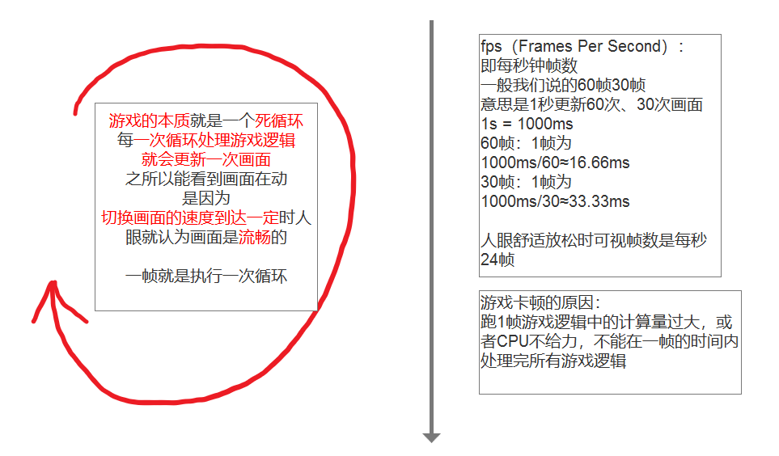
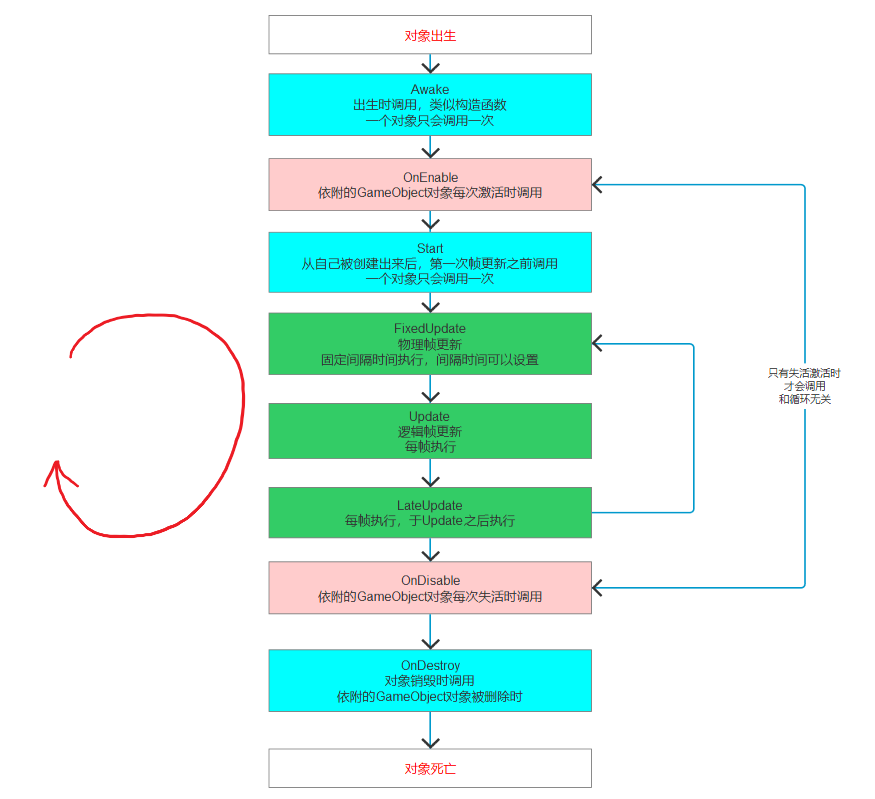

## 0.06脚本相关 生命周期函数

在Unity中，继承自`MonoBehaviour`的脚本可以在`Awake`或`Start`方法中进行初始化。选择哪个方法取决于初始化的需求和执行时机的不同：

- **`Awake()`**：该方法在脚本实例化后、场景加载时立即调用。适用于需要在其他组件的`Start()`方法之前完成初始化的场景。
- **`Start()`**：在所有`Awake()`方法调用之后，并在第一次`Update()`之前调用。适用于依赖于其他组件或对象的初始化逻辑。

**注意**：**切记不要在继承自`MonoBehaviour`的脚本中使用`new`关键字创建实例！**

此外，Unity中的所有生命周期函数都是在主线程中按顺序依次执行的，这确保了游戏逻辑的连贯性和同步性。

总结：

- 根据初始化的需求选择在`Awake()`或`Start()`方法中进行操作。
- 不要在继承自`MonoBehaviour`的脚本中使用`new`。
- 生命周期函数在主线程中按顺序执行，确保同步。

### 1. **"Don't Call Methods in Awake" (Monobehaviours and ScriptableObject)**

- **含义**: 不要在`Awake`方法中调用其他方法，尤其是那些依赖于其他对象或组件状态的方法。
- **原因**:
    - `Awake()`是Unity中最早被调用的生命周期方法之一，通常用于初始化脚本本身的数据。此时，其他对象的`Awake()`方法可能尚未被调用完成，因此，如果在`Awake()`中调用依赖于其他对象状态的方法，可能会遇到未初始化或不稳定的状态。
    - 例如，如果你在`Awake()`中试图访问另一个对象或组件，而该对象或组件的`Awake()`方法尚未执行完毕，你可能会遇到`NullReferenceException`或者得到错误的数据。
- **适用范围**: 这一准则不仅适用于`MonoBehaviour`，也适用于`ScriptableObject`，因为这两种类型都可能涉及到复杂的依赖关系和初始化过程。

### 2. **"All State Should Be Safe to Access by Start"**

- **含义**: 所有在`Start`方法中需要访问的状态应该在此时已安全、稳定，并且完全初始化。
- **原因**:
    - `Start()`方法在所有`Awake()`方法执行完毕后被调用，此时场景中的所有对象和组件已经完成了初始化。因此，`Start()`方法通常用于设置依赖于其他对象或组件的初始状态。
    - 通过确保所有状态在`Start()`时已准备就绪，你可以在`Start()`中安全地调用方法并访问数据，而不会担心初始化过程的不完整性。
- **实践建议**: 在编写代码时，确保`Start()`方法中的变量和状态都已在`Awake()`或其他合适的初始化阶段完成初始化。例如，确保在`Awake()`或更早阶段初始化了所有的组件引用或脚本实例。

### 3. **"Check All Uses of Variables Initialized in Start"**

- **含义**: 检查在`Start`方法中初始化的所有变量的使用情况，确保在使用这些变量时它们已正确初始化。
- **原因**:
    - 如果某些变量在`Start()`中被初始化，而你在`Start()`之前的其他方法（如`Awake()`或构造函数）中尝试使用这些变量，可能会导致未初始化的问题。
    - 为了防止未初始化的问题，建议你在`Start()`之前的任何方法中避免访问这些变量，或者明确检查变量是否已被正确初始化。
- **实践建议**: 在开发过程中，可以使用工具或调试手段，确保在代码执行过程中不会访问未初始化的变量。

### 总结：

- **不要在`Awake`中调用依赖于其他对象或组件状态的方法**，以确保初始化顺序的正确性。
- **所有状态在`Start`时都应该是安全和稳定的**，以便你可以在`Start`中安全地进行依赖于其他组件的初始化。
- **检查所有在`Start`中初始化的变量**，确保它们不会在不合适的时机被访问。

