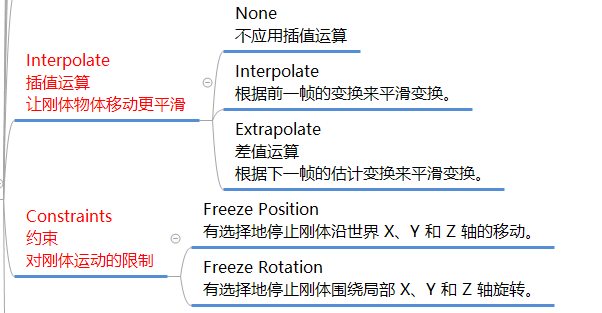

## 0.56刚体参数说明图

## 刚体参数说明图
写几个我认为重点的知识
### Interpolate 属性

`Rigidbody.interpolation` 属性有三个选项：

1. **None**（默认值）：不进行插帧。这是最基本的设置，物体会按照物理引擎计算的位置和旋转进行更新。这在高帧率和稳定帧率下效果最好。
2. **Interpolate**：使用插帧。这种模式下，物体的位置和旋转将会在当前帧和前一帧之间进行线性插值。这可以使物体的运动在低帧率或不稳定帧率下显得更加平滑。
3. **Extrapolate**：使用外推。这种模式下，物体的位置和旋转将会基于当前帧和前一帧的速度进行外推。这可以使物体的运动在低帧率下显得更加自然和连贯。

### Constraints

`Constraints` 这个属性有两类约束：

1. **位置约束（Freeze Position）**：控制物体在 x、y、z 轴上的移动。
2. **旋转约束（Freeze Rotation）**：控制物体在 x、y、z 轴上的旋转。

### Collision Detection

| 碰撞检测方式                 | 说明                                                 | 游戏示例                                                  |
| ---------------------- | -------------------------------------------------- | ----------------------------------------------------- |
| Discrete               | 离散碰撞检测,每帧检测一次。适用于低速移动或静止的物体。                       | 1. 益智游戏中的方块堆叠 2. 冒险游戏中的物品收集                        |
| Continuous             | 连续碰撞检测,在物体移动路径上进行检测。适用于高速移动的物体。                    | 1. 赛车游戏中的车辆碰撞 2. 射击游戏中的子弹碰撞                        |
| Continuous Dynamic     | 连续动态碰撞检测,综合了 Discrete 和 Continuous 的优点。自动选择最优检测方式。 | 1. 物理益智游戏"Angry Birds" 2. 开放世界游戏"塞尔达传说:旷野之息"中的物理交互 |
| Continuous Speculative | 连续推测碰撞检测,在 Continuous 的基础上增加了预测功能,提高了高速碰撞的精确度。     | 1. 格斗游戏中的高速攻击判定 2. 体育游戏如"FIFA"中的足球碰撞               |

